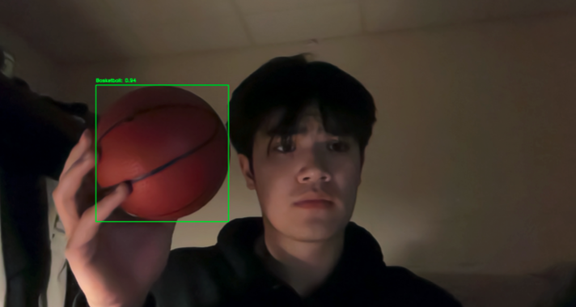
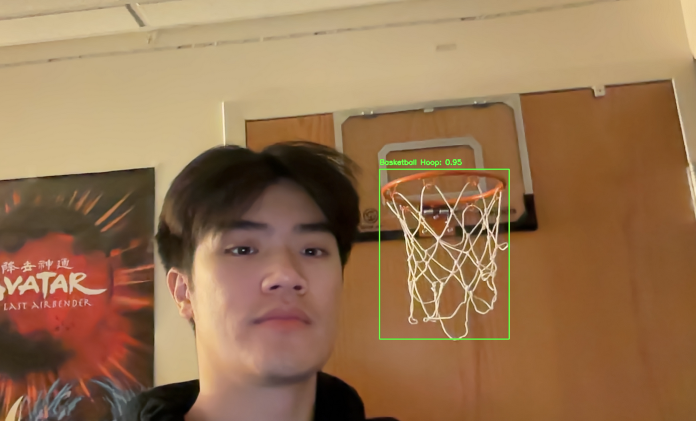
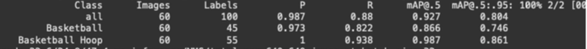

# basketball-shot-tracker
cv application that tracks basketball shots as makes or misses

## Instructions to Run

1. Clone repository from terminal

`git clone https://github.com/kylephan5/basketball-shot-tracker.git`

2. cd into repository

`cd basketball-shot-tracker`

4. Create virtual environment

`python3 -m venv virtualenv`

`source virtualenv/bin/activate`

3. Install requirements

`pip install -r requirements.txt`

4. Clone YOLOv7

`git clone https://github.com/WongKinYiu/yolov7.git`

6. Run program

`python3 main.py`

## Description of Project

This project aims to track basketball shots as makes or misses, and will offer you a percentage based on how many shots it detects. From a high level, I'll need to run a training set on various basketball hoops and basketball so that my live videostream will be able to pick up the hoop and the basketball in real time. Looking for a dataset will be challenging, but I've found one [here](https://universe.roboflow.com/034-ganesh-kumar-m-v-cs-r2lwe/basketball-lhqoe/dataset/1/images). This dataset provides me with three hundred images, partitioned into 70/20/10 splits. These splits will be useful as we train our model on this dataset to detect for basketball hoop and basketballs.

The fun part of the project is detecting whether or not the shot was a make or miss. My initial idea would be to utilize the YOLO detection algorithm for object detection, as this would be a pretty good start for determining whether or not the ball was a miss or make. One of the key distinguishers of whether or not the ball would be particularly good for me to use as a "basketball" would be if the ball is spherical. I believe that this would have a little bit of computation, as it would have to be able to tell me the first time that the ball is completely below or above the rim.

If the ball is found above the rim initially and then falls outside of the bounds of the net, then it would make sense for it to be a miss. However, if the ball happens to be found in the rim/net area, it must mean that it's a make. I'm a little unclear on how initially I'd perform this, but I'm sure with the YOLO detection I could get a coordinate point and somehow "map" the point to a specific point on the axis. Another key here will be finding and performing the math that is involved with the box surrounding the basket/net. I also think it might be useful for me to draw points on the path of the basketball. If at any point it's above the rim (which we'll have to draw a line to understand what y value that is at) and then falls into the rim (width of the rim), then we're good and we have a basket.

I also want to reiterate the dataset and the lack of data that is out there. Luckily enough, I really only have to detect two objects – the basketball and the basketball hoop. The person and anything else in the frame is somewhat irrelevant. I believe that one of the distinguishing factors is that we'll want to ensure that there's only one hoop in the frame so that the math computation will not get wonky with the basketball distinguishing. I'm really excited to work on this project and am excited to see the final result, which I think will be a really neat culmination of learning various object detection methodologies. I have worked with FasterRCNN a bit in the past for object detection, but am excited to try my hand with YOLO and see what I can make with it!

## Part 2

I've acquired two datasets for usage, each with 300 images in each dataset [here](https://universe.roboflow.com/034-ganesh-kumar-m-v-cs-r2lwe/basketball-lhqoe/dataset/1) and [here](https://universe.roboflow.com/rodney-virtualassistant-gmail-com/basketball-annotation-project/dataset/2). These datasets together will give me a fair amount of data to train on just two different objects, a basketball and a basketball hoop. I think both the training and validation subsets are important, but the training is probably more important as I'll want to be able to train my neural network's weights.

These pictures are sometimes captured by camera or were found on the internet, most of them are in daytime ambient conditions or without any color interference with the background. The resolution varies from picture to picture, but is strong enough to determine/decipher a basketball and basketball hoop.

## Part 3

This report is a comprehensive detailed outline of the work that I have completed so far. As of November 10th, I have found a dataset on Roboflow that has already been pre-annotated for me, and detects basketballs and basketball hoops. The dataset has already been segmented into 70/20/10 splits for training, validation, and testing purposes. These splits are important for us because we want to track the mAP, and ensure that the training is not being underfitted or overfitted to our new dataset. The methods that I’ve used for pre-processing has been relatively straightforward, and I’ve leveraged previously annotated datasets in order to streamline my efficiency and ability to jump into the meat of my project.

I performed transfer learning on a YOLOv7 model in order to detect my two classes, a basketball and a basketball hoop. I figured that YOLO would be a great tool for my project as opposed to other pretrained models because of its speed and efficiency. Since it’s designed to be fast (makes sense, considering the model is called you only look once), it can detect objects in real-time, which is important for applications that need to have quick decision-making. In addition, since I don’t need intensely precise detection, it makes it a worthy candidate for my project at hand. YOLO performs extremely well in most real-world scenarios. Using YOLO has been great for developer reasons as well – there is a growing community of developers that are constantly looking to optimize the model. I was also considering using Faster RCNN, which has strengths in being able to detect small objects and is extremely accurate. However, this model is relatively slow compared to single stage detectors like the one I used in YOLO, which isn’t as practical for my real-time application. Faster RCNN is really good for when I need to prioritize accuracy over speed, but in my application I want to make sure that I’m able to get the right points that are above and below the rim height, and not super concerned with anything other than that in terms of accuracy. Another option that I considered was using MobileNet SSD, which is optimized for mobile computer vision applications that need to run on devices such as an iPhone. However, my application will likely be ran on my computer, and therefore utilizing MobileNet seems to be optimizing something that’s simply unnecessary for my specific use case. Utilizing YOLO is the perfect blend that I need in order to ensure that my application runs well.

In addition, because I only needed to detect two objects, a dataset of 300 items is sufficient since some of these items also have overlaps. Furthermore, I will soon use these objects and the position of them at various frames to perform a linear regression to find the intersection point between a point above and below the rim. This would make me need to find the orange rim and make that the plane of intersection for points above and below.

Image of basketball detection

Image of basketball hoop detection

Validation Set with some key metrics

Here are a few results from my training. As you can see, it does a pretty good job detecting basketball and basketball hoops with relatively high confidence. Because of this, it seems as if my project has done an adequate job of detecting the necessary objects. It seems like some instances of basketball might be missed with a relatively low R value, which means I might want to lower the confidence threshold in order to help the model detect more objects. This also comes with the tradeoff of possibly identifying more false positives, which is also not a great thing. I could also try training with more data, which would allow for detection of more basketballs. However, of the two datasets I found, I found that a lot of the pictures and labelling overlapped, meaning most of these pictures are the same pictures.

I think going forward, this will do a pretty good job of detecting what I need to detect for my algorithm. I don’t need the points to be the exact point below the exact point above, as the general trajectory of the basketball is the more important aspect here rather than the precision of a specific point. Beyond this, I think my algorithm might struggle if a miss is straight on. The best way to counteract this problem would be to implement an additional camera on the side that gives me a peripheral view, and in order to deem it as a make, needs to fall within the bounds of the basketball hoop. Having a 2D view of this would be important. To extend this, we could also have it be 3D where I consider the Z axis with an aerial camera above the basket. However, I simply don’t have the facilities for something like this at the moment, and therefore a single camera setup will be sufficient in most cases.

I have been in complete control of all parts of the software development cycle, from the dataset finding to the model selection to the transfer learning and lastly, to building the object detection algorithm. It’s pretty important for me to understand all aspects of the software development cycle and have the context in order for me to tackle the problems that may be asked of me in this project.

## Part 4

Picking a classifier was somewhat of an interesting decision. I decided to utilize YOLOv7 for my object detection model, which under the hood utilizes convolutional neural networks (CNNs) to perform classification on objects in images. Utilizing convolutional neural networks makes the most sense for my test case, since my application is primarily focused on object detection. YOLOv7 provides high accuracy while minimizing latency, which is pretty ideal for my application which focuses on live shot detection and tracking. Its ability to detect multiple objects simultaneously (basketball and basketball hoop) makes it an ideal candidate for my application. Leveraging a pre-trained model and transfer learning the model on my custom classes has been pretty solid. Given some more time, I likely would have trained it for longer, since the detection does work but could use some extra training time, since it's detecting some other spherical objects as basketballs (at a lower confidence value).

Since part 3, I've also incorporated an object tracking algorithm in order to make it so that I can log additional points at a better rate. Utilizing CSRT has been the perfect balance for me. I've tried using MOSSE, but since it overdetects, it doesn't do a great job visually for my linear regression. Even though CSRT has relatively slow tracking speed, it does a good job of finding enough points where I can perform some sort of point slope analysis in order to find the point of intersection at rim height.

I shot 25 shots, and kept track of the performance of each shot. It detected (make or miss) correctly 88% of the time, or 22/25 tries. For the 3 errant tries, I noticed why exactly they faltered. For one of the shots, the ball had left the frame. CSRT struggles with finding objects that move in and out of the frame, and so it makes sense that when the object does move out of the frame, CSRT loses the object and can no longer detect it. From here, the object is obscure and so therefore YOLO struggles with this. Improvements to this would be performing some sort of color segmentation. Converting the red/orange hue of the basketball into HSV and then finding contours would allow me to find specific basketball objects in it. However, this problem is easily solved by improving my hardware and getting a better performing camera that I can zoom out and have the basketball stay within the frame on the shot.

The other situation that I noticed that could cause problems is if the shot misses directly short. In this situation, the basketball will simply drop right in front of the basketball, and based on my logic, will look like it went in. An easy fix to this would be to have two cameras, one straight on from the basket and one on the side. In order for a basket to be considered a make, it would have to pass the point slope test for both the lateral and the face on view. This would ensure that it fell somewhere through this 2D plane, and not just 1D.

The other error that I missed was because the ball spun around the hoop, and the CSRT detected the ball as passing the rim even though it was not fully passed. I'm sure there is something that I can do here, possibly use the midpoint of the rim as the point of when to detect make. This would allow any of those that roll around the rim to not be detected until it comes out from under the basket.

On the other hand, it does a really good job of detecting most* makes!

Here's an example of a video:

This video does a good job of showing the miss and makes, and how my program works. The blue dot follows the basketball object and will focus on the object as it moves through the air, registering the values and ensuring that when we see the ball fall close to the basket, that we are possibly detecting a shot. As you can see, the shot rises in the air, falls through the hoop, at which point the blue dot travels and finds a point below. One of the problems that I was running in to was if the ball was rolling around the rim, where it would count as multiple tries since it possibly would go from above to below the rim multiple times.

This is something that I will try to improve before final testing. I saw relatively good accuracy in my training set, and also when I uploaded a random video, I saw good results as well.

